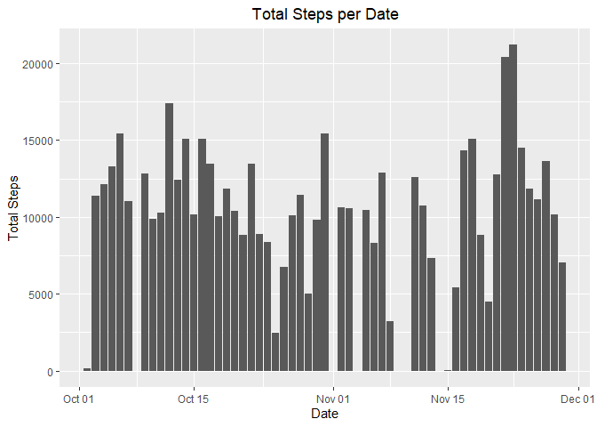
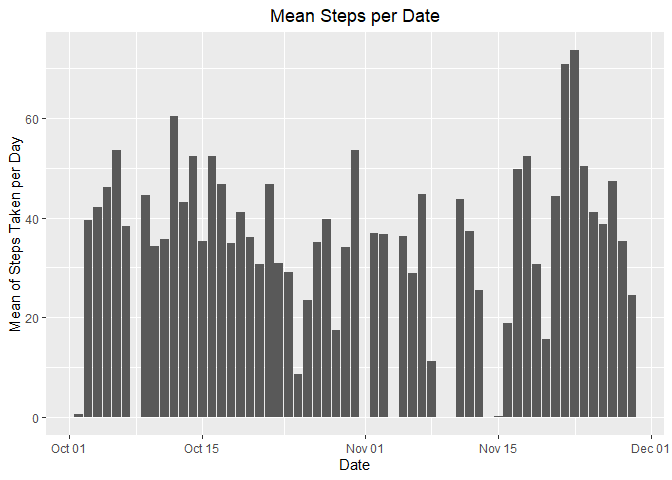
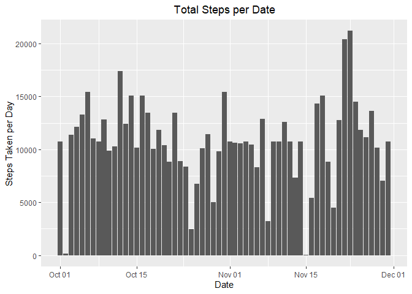

Reading and exploring the basics of the data


```r
unzip("./activity.zip")
activitydata <- read.csv("./activity.csv")
summary(activitydata)
```

```
##      steps            date              interval     
##  Min.   :  0.00   Length:17568       Min.   :   0.0  
##  1st Qu.:  0.00   Class :character   1st Qu.: 588.8  
##  Median :  0.00   Mode  :character   Median :1177.5  
##  Mean   : 37.38                      Mean   :1177.5  
##  3rd Qu.: 12.00                      3rd Qu.:1766.2  
##  Max.   :806.00                      Max.   :2355.0  
##  NA's   :2304
```

```r
dim(activitydata)
```

```
## [1] 17568     3
```

```r
names(activitydata)
```

```
## [1] "steps"    "date"     "interval"
```

```r
head(activitydata)
```

```
##   steps       date interval
## 1    NA 2012-10-01        0
## 2    NA 2012-10-01        5
## 3    NA 2012-10-01       10
## 4    NA 2012-10-01       15
## 5    NA 2012-10-01       20
## 6    NA 2012-10-01       25
```

Transforming the date using lubridate


```r
library(lubridate)
```

```
## 
## Attaching package: 'lubridate'
```

```
## The following objects are masked from 'package:base':
## 
##     date, intersect, setdiff, union
```

```r
activitydata$date <- ymd(activitydata$date)
```

Histogram of the total number of steps taken each day.


```r
library(ggplot2)
stepsperday <- aggregate(steps ~ date, activitydata, sum, na.rm = TRUE)

ggplot(stepsperday, aes(x=date, y=steps)) + geom_bar(stat = "identity") + xlab("Date") + ylab("Total Steps") + ggtitle("Total Steps per Date") + theme(plot.title = element_text(hjust = 0.5))
```

<!-- -->

Mean and median of the total number of steps taken per date

Mean: 

```r
meansteps <- mean(stepsperday$steps)
meansteps
```

```
## [1] 10766.19
```

Median:

```r
mediansteps <- median(stepsperday$steps)
mediansteps
```

```
## [1] 10765
```

Histogram of the mean number of steps taken per day


```r
stepsmean <- aggregate(steps ~ date, activitydata, mean, na.rm = TRUE)

ggplot(stepsmean, aes(x=date, y=steps)) + geom_bar(stat = "identity") + xlab("Date") + ylab("Mean of Steps Taken per Day") + ggtitle("Mean Steps per Date") + theme(plot.title = element_text(hjust = 0.5))
```

<!-- -->

Time series plot of the average number of steps taken (average daily activity pattern)


```r
activitydf <- data.frame(activitydata)
stepsperinterval <- aggregate(steps ~ interval, activitydf, mean, na.rm = TRUE)

plot(steps ~ interval, data = stepsperinterval, type = "l")
```

<!-- -->

5-minute interval with the maximum number of steps


```r
intervalwithmaxsteps <- stepsperinterval[which.max(stepsperinterval$steps),]$interval
intervalwithmaxsteps
```

```
## [1] 835
```

Imputing missing values

Total number of missing values:

```r
totalmissing <- sum(is.na(activitydata$steps))
totalmissing
```

```
## [1] 2304
```

Strategy for filling out missing value: substitute the missing values with means


```r
getmeansperinterval <- function(interval) {stepsperinterval[stepsperinterval$interval == interval,]$steps}
```

New dataset with imputed missing values


```r
activitydfimputed <- activitydf; 
  for(i in 1:nrow(activitydfimputed)) { 
    if(is.na(activitydfimputed[i,]$steps)){activitydfimputed[i,]$steps <- getmeansperinterval(activitydfimputed[i,]$interval)}}
```

Histogram of the total number of steps taken each day after missing values are imputed


```r
stepsperdayimputed <- data.frame(aggregate(steps ~ date, data = activitydfimputed, sum))

ggplot(stepsperdayimputed, aes(x=date, y=steps)) + geom_bar(stat = "identity") + xlab("Date") + ylab("Steps Taken per Day") + ggtitle("Total Steps per Date") + theme(plot.title = element_text(hjust = 0.5))
```

<!-- -->

Mean and median of the total number of steps taken per date (based on the new dataset)

Mean:

```r
meanstepsimputed <- mean(stepsperdayimputed$steps)
meanstepsimputed
```

```
## [1] 10766.19
```

Median:

```r
medianstepsimputed <- median(stepsperday$steps)
medianstepsimputed
```

```
## [1] 10765
```

Activity patterns between weekdays and weekends

Creating a new factor variable in the dataset with two levels - "weekday" and "weekend"


```r
activitydfimputed$date <- as.Date(strptime(activitydfimputed$date, format = "%Y-%m-%d"))

activitydfimputed$day <- weekdays(activitydfimputed$date);
  for (i in 1:nrow(activitydfimputed)) {
    if (activitydfimputed[i,]$day %in% c("Saturday", "Sunday")) {
      activitydfimputed[i,]$day <- "weekend"
    }
    else{
      activitydfimputed[i,]$day <- "weekday"
    }
  }

stepsbyday <- aggregate(activitydfimputed$steps ~ activitydfimputed$interval + activitydfimputed$day, activitydfimputed, mean)
```

Panel plot containing a time series plot of the 5-minute interval and the average number of steps taken, averaged across all weekday days or weekend days.


```r
names(stepsbyday) <- c("interval", "day", "steps")
library(lattice)

xyplot(steps ~ interval | day, stepsbyday, type = "l", layout = c(1,2), xlab = "Interval", ylab = "Number of steps")
```

<!-- -->


## Loading and preprocessing the data


## What is mean total number of steps taken per day?


## What is the average daily activity pattern?


## Imputing missing values


## Are there differences in activity patterns between weekdays and weekends?
